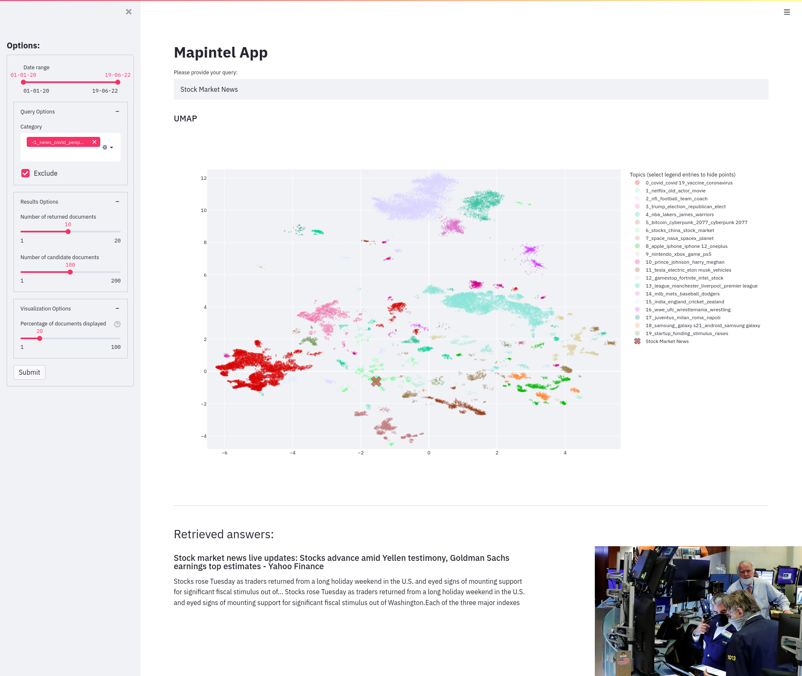

[black badge]: <https://img.shields.io/badge/%20style-black-000000.svg>
[black]: <https://github.com/psf/black>
[ruff badge]: <https://img.shields.io/endpoint?url=https://raw.githubusercontent.com/charliermarsh/ruff/main/assets/badge/v1.json>
[ruff]: <https://github.com/charliermarsh/ruff>
[mkdocs badge]: <https://img.shields.io/badge/docs-mkdocs%20material-blue.svg?style=flat>
[mkdocs]: <https://squidfunk.github.io/mkdocs-material>
[version badge]: <https://img.shields.io/pypi/v/MapIntel.svg>
[pythonversion badge]: <https://img.shields.io/pypi/pyversions/MapIntel.svg>
[downloads badge]: <https://img.shields.io/pypi/dd/MapIntel>
[gitter]: <https://gitter.im/MapIntel/community>
[gitter badge]: <https://badges.gitter.im/join%20chat.svg>
[ci]: <https://github.com/NOVA-IMS-Innovation-and-Analytics-Lab/MapIntel/actions?query=workflow>
[ci badge]: <https://github.com/NOVA-IMS-Innovation-and-Analytics-Lab/MapIntel/actions/workflows/ci.yml/badge.svg>
[doc]: <https://github.com/NOVA-IMS-Innovation-and-Analytics-Lab/MapIntel/actions?query=workflow>
[doc badge]: <https://github.com/NOVA-IMS-Innovation-and-Analytics-Lab/MapIntel/actions/workflows/doc.yml/badge.svg?branch=master>

# MapIntel

[![ci][ci badge]][ci] [![doc][doc badge]][doc]

|          | Tools |
| -------- | -------- |
| **Development** | [![black][black badge]][black] [![ruff][ruff badge]][ruff] |
| **Package** | ![version][version badge] ![pythonversion][pythonversion badge] ![downloads][downloads badge] |
| **Documentation** | [![mkdocs][mkdocs badge]][mkdocs]|
| **Community** | [![gitter][gitter badge]][gitter] |

MapIntel is a system for acquiring intelligence from vast collections of text data by representing
each document as a multidimensional vector that captures its own semantics. The system is designed
to handle complex Natural Language queries and visual exploration of the corpus.

The system searching module uses a retriever and re-ranker engine that first finds the closest
neighbors to the query embedding and then sifts the results through a cross-encoder model that
identifies the most relevant documents. The browsing module also leverages the embeddings by
projecting them onto two dimensions while preserving the multidimensional landscape, resulting in a
map where semantically related documents form topical clusters which we capture using topic
modeling. This map aims at promoting a fast overview of the corpus while allowing a more detailed
exploration and interactive information encountering process.

MapIntel can be used to explore many different types of corpora.



## Installation

With `pip`:

```bash
pip install mapintel
```

## Usage

Run API:

```bash
python -m mapintel.services.api_endpoint
```

API is available at localhost:30000/docs

Run UI:

```bash
streamlit run ./src/mapintel/ui/webapp.py
```

UI is available at localhost:8501

